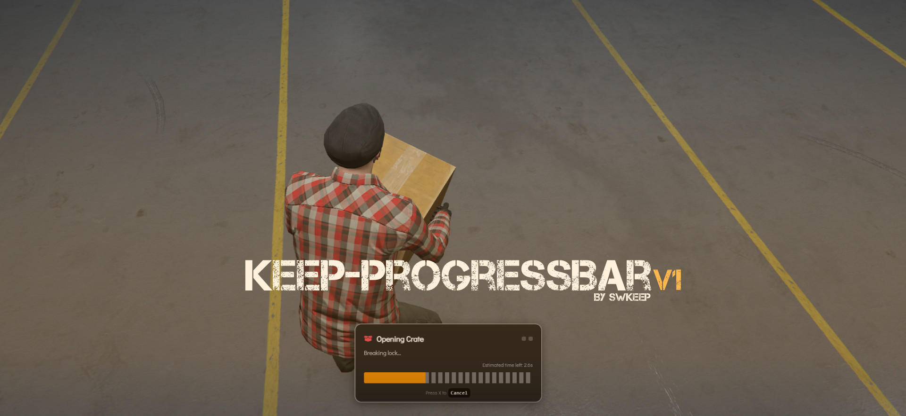

# keep-progressbar

<center>



</center>

A flexible, progress bar system for FiveM.  
Supports animations, props, stages/minigames, cancel/death monitoring, networked props with blacklist protection, and more.

## Features

- Multi-stage progress with optional **skill-check / minigame** support
- Animation helper with synchronized scenes and entity attachments
- Automatic cleanup server and client side
- Prop support: multiple props per action
- Customizable cancel button
- Animation hookss
- Themes

## Installation

1. Clone or download this repo into your FiveM resources folder:

    - For `QBCore`: move the `progressbar` resource from `[standalone]` to somewhere else.

    ```bash
    resources/[standalone]/keep-progressbar
    ```

2. Add to your `server.cfg`:

    ```cfg
    ensure keep-progressbar
    ```

## Usage

### Basic Usage

```lua
exports['keep-progressbar']:Start({
    duration = 5000,
    label = "Loading Crate",
    icon = "fa-solid fa-box",
    canCancel = true,
    useWhileDead = false,
    controlDisables = {
        disableMovement = true,
        disableCombat = true,
    },
    animation = {
        animDict = "anim@heists@box_crate@load",
        anim = "load_box",
        duration = 5000,
        lockX = true,
        lockY = false,
        lockZ = true,
    },
    prop = {
        model = "prop_crate_01a",
        bone = 28422,
        coords = vec3(0.0, 0.0, 0.0),
        rotation = vec3(0.0, 0.0, 0.0),
    }
}, function(cancelled)
    if not cancelled then
        print("✅ completed")
    else
        print("❌ Cancelled.")
    end
end)
```

### Multi-stage progress

```lua
exports['keep-progressbar']:Start({
    label = "Opening Crate",
    icon = "fa-solid fa-box-open",
    animation = {
        task = "WORLD_HUMAN_CLIPBOARD"
    },
    canCancel = true,
    controlDisables = { disableMovement = true, disableCombat = true },
    stages = {
        { message = "Breaking lock...", duration = 3000 },
        { message = "Opening door...", duration = 2000 },
    },
    props = {
        {
            model = "prop_ld_case_01",
            bone = 57005,
            coords = vec3(0, 0, 0),
            rotation = vec3(0, 0, 0),
        },
    }
}, function(cancel, result)
    if not cancel then
        print("✅ Crate opened!")
    else
        print("❌ Aborted opening crate.")
    end
end)
```

## 📦 Examples

I’ve provided a bunch of examples for different features in `lua/examples.lua`

## `Start`

### Options

| Key               | Type       | Description                                                                                      |
|-------------------|------------|--------------------------------------------------------------------------------------------------|
| `duration`        | number(ms) | Total duration if no `stages` are used                                                           |
| `label`           | string     | Title of progress window                                                                         |
| `icon`            | string     | Icon (FontAwesome)                                                                               |
| `useWhileDead`    | boolean    | Allow while dead                                                                                 |
| `canCancel`       | boolean    | Whether player can progress cancel or not                                                        |
| `controlDisables` | table      | e.g. `{ disableMovement=true, disableCarMovement=true, disableMouse=false, disableCombat=true }` |
| `theme`           | string     | Optional theme name                                                                              |
| `position`        | string     | UI position (e.g. `center-top`)                                                                  |
| `offset`          | vec3       | Progress bar offset                                                                              |
| `prop`            | table      | Single prop attached during progress                                                             |
| `propTwo`         | table      | Single prop attached during progress                                                             |
| `props`           | table[]    | Array of props                                                                                   |
| `animation`       | table      | Single animation                                                                                 |
| `animations`      | table[]    | Array of animations                                                                              |
| `stages`          | table[]    | Array of stages                                                                                  |

**Prop, PropTwo, Props:**

| Field      | Type    | Description        |
|------------|---------|--------------------|
| `model`    | string  | Model name         |
| `bone`     | number  | Bone index         |
| `coords`   | vector3 | Offset coordinates |
| `rotation` | vector3 | Rotation           |

```lua
prop = {
    model = "prop_police_phone",
    bone = 28422,
    coords = vector3(0.00, 0.0, 0.0),
    rotation = vector3(0.0, 0.0, 0.0),
},
propTwo = {
    model = "prop_police_phone",
    bone = 28422,
    coords = vector3(0.00, 0.0, 0.0),
    rotation = vector3(0.0, 0.0, 0.0),
},
```

Or simply using an array

```lua
props = {
    {
        model = "prop_police_phone",
        bone = 28422,
        coords = vector3(0.00, 0.0, 0.0),
        rotation = vector3(0.0, 0.0, 0.0),
    }
}
```

**Animation:**

| Field      | Type   | Description                    |
|------------|--------|--------------------------------|
| `animDict` | string | Animation dictionary           |
| `anim`     | string | Animation name                 |
| `flags`    | number | Animation flags                |
| `duration` | number | Duration in ms                 |
| `blendIn`  | number | Blend-in speed                 |
| `blendOut` | number | Blend-out speed                |
| `onStart`  | func   | Called at start                |
| `onTick`   | func   | Called during, with frame time |
| `onFinish` | func   | Called after                   |

Single animation

```lua
animation = {
    animDict = "anim@heists@humane_labs@emp@hack_door",
    anim = "hack_loop",
},
```

Array of animations

```lua

animations = {
    {
        animDict = "anim@heists@humane_labs@emp@hack_door",
        anim = "hack_intro",
        flags = 1,
        duration = 2500,
        blendIn = 3.0,
        blendOut = 3.0,
    },
    {
        animDict = "anim@heists@humane_labs@emp@hack_door",
        anim = "hack_loop",
        flags = 1,
        duration = 3000,
        blendIn = 3.0,
        blendOut = 3.0,
    },
    {
        animDict = "anim@heists@humane_labs@emp@hack_door",
        anim = "hack_outro",
        flags = 1,
        duration = 2000,
        blendIn = 3.0,
        blendOut = 3.0,
    }
},

```

### Stages

Each stage is a table inside `stages` array.

| Field           | Type    | Description                                                                         |
|-----------------|---------|-------------------------------------------------------------------------------------|
| `message`       | string  | Stage text shown to player                                                          |
| `duration`      | number  | Stage duration (ms)                                                                 |
| `progressColor` | string  | Optional color                                                                      |
| `animation`     | table   | Stage specific animation                                                            |
| `minigame`      | func    | Returns boolean or result                                                           |
| `cancelMode`    | boolean | Changes how minigame works: `hard` = reset/close on fail, `soft` = continue on fail |
| `onFinish`      | func    | Called when stage completes                                                         |
| `condition`     | func    | Must return true before stage proceeds                                              |

```lua

stages = {
    { message = "Breaking lock...", duration = 1000 },
    {
        message = "Opening door...",
        duration = 2000,
        condition = function()
            return trigger_condition
        end,
        minigame = function()
            return lib
                .skillCheck({ 'easy', 'easy' }, { 'w', 'a', 's', 'd' })
        end,
        animation = {
            animDict = "anim@heists@humane_labs@emp@hack_door",
            anim = "hack_intro",
            flags = 1,
            duration = 2500,
            blendIn = 3.0,
            blendOut = 3.0,
        }
    },
    { message = "Opening door...",  duration = 2000 },
},

```

### Callback

| Parameter   | Type | Description                    |
|-------------|------|--------------------------------|
| `cancelled` | bool | Whether progress was cancelled |
| `result`    | any  | Skill check outcome            |

```lua
exports['keep-progressbar']:Start({ ... }, function(cancelled, result)
  
end)
```
